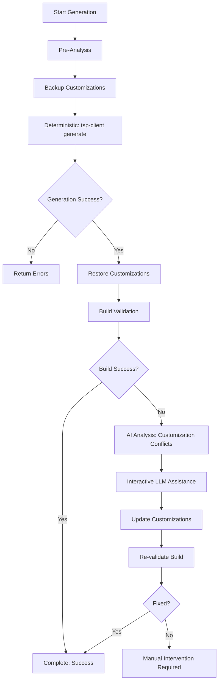

# TypeSpec SDK Generation with Customizations - Solution Architecture

## Problem Statement

The core issue described in [this gist comment](https://gist.github.com/samvaity/596bd1a69175aa236106a3ad0dc7fc02?permalink_comment_id=5679153#gistcomment-5679153) is that **TypeSpec SDK regeneration overwrites manual customizations**, causing build failures and requiring manual intervention to restore functionality.

### Specific Pain Points

1. **Customization Loss**: `tsp-client generate` overwrites existing customization files
2. **Build Failures**: Regenerated code conflicts with preserved customizations
3. **Manual Intervention**: No systematic way to update customizations for new generated code
4. **Inconsistent Workflows**: Different SDK languages handle "generate SDK" differently

## Solution Architecture

### 🎯 Core Innovation: Hybrid Deterministic + AI-Assisted Workflow



### 🔄 Two-Phase Approach

#### Phase 1: Deterministic (Script-Based)
- ✅ **tsp-client update/generate**: Reliable, reproducible TypeSpec operations
- ✅ **Backup & Restore**: Systematic customization preservation
- ✅ **Build Validation**: Automated conflict detection

#### Phase 2: Interactive (AI-Assisted)
- 🤖 **Customization Analysis**: AI identifies what needs updating
- 🤖 **Conflict Resolution**: AI suggests specific fixes for build errors
- 🤖 **Pattern Learning**: AI learns common customization update patterns

## Cross-Language SDK Generation Contract

### 📋 Standardized Scope Definitions

| Scope | Java | .NET | Python | JavaScript/TypeScript | Go |
|-------|------|------|--------|----------------------|-----|
| `code-only` | Source files | Source files | Source files | Source files | Source files |
| `code-with-changelog` | Source + CHANGELOG.md | Source + CHANGELOG.md | Source + CHANGELOG.md | Source + CHANGELOG.md | Source + CHANGELOG.md |
| `full-package` | Source + CHANGELOG + Maven validate | Source + CHANGELOG + MSBuild | Source + CHANGELOG + pip validate | Source + CHANGELOG + npm validate | Source + CHANGELOG + go build |

### 🛡️ Customization Contract

```typescript
interface SDKGenerationContract {
    // Input standardization across ALL languages
    scope: "code-only" | "code-with-changelog" | "full-package";
    preserveCustomizations: boolean;
    validateBuild: boolean;
    interactiveMode: boolean;
    
    // Language-specific customization files
    customizationFiles: {
        java: "customization.json",
        dotnet: "customization.json", 
        python: "customization.json",
        typescript: "customization.json",
        go: "customization.json"
    };
    
    // Standardized output expectations
    outputs: {
        generatedFiles: string[];
        updatedCustomizations: string[];
        buildValidation: boolean;
        manualStepsRequired: string[];
    };
}
```

### 🎯 Problem Resolution Strategy

#### For Deterministic Steps
```bash
# These work the same across all languages
tsp-client update --save-inputs
tsp-client generate --debug
```

#### For Customizations (AI-Enhanced)
```typescript
// This requires language-specific AI analysis
async function updateCustomizations(context: CustomizationContext) {
    // 1. Analyze generated code changes
    const changes = await analyzeGeneratedChanges(context);
    
    // 2. Identify customization conflicts  
    const conflicts = await detectCustomizationConflicts(changes, context.customizations);
    
    // 3. AI-assisted resolution
    const solutions = await ai.resolveCustomizationConflicts(conflicts);
    
    // 4. Apply updates
    await applyCustomizationUpdates(solutions);
    
    // 5. Validate build
    return await validateBuild(context.moduleDirectory);
}
```

## Implementation Benefits

### ✅ Solves Core Problems

1. **No More Customization Loss**: Systematic backup and restore
2. **Build Conflicts Detected**: Automated validation catches issues immediately  
3. **AI-Assisted Resolution**: LLM helps update customizations intelligently
4. **Cross-Language Consistency**: Same contract and expectations everywhere

### ✅ Developer Experience Improvements

1. **Clear Expectations**: "Generate SDK" always does the same thing across languages
2. **Predictable Scope**: Developers know exactly what will be generated
3. **Intelligent Assistance**: AI helps with the hard parts (customization updates)
4. **No Surprises**: Build validation prevents silent failures

### ✅ CI/CD Integration

```yaml
# Same workflow pattern for all languages
- name: Generate SDK with Customizations
  uses: azure-sdk-mcp/generate-with-customizations
  with:
    moduleDirectory: ${{ matrix.module }}
    scope: "code-with-changelog" 
    preserveCustomizations: true
    validateBuild: true
    interactiveMode: false  # CI uses deterministic mode
```

## Advanced Features

### 🎯 Build Error-Driven Customization Updates

When build validation fails, the tool automatically:

1. **Parses Maven/MSBuild/pip errors** to identify specific issues
2. **Maps errors to customization fixes** using AI pattern recognition
3. **Suggests precise updates** rather than generic advice
4. **Learns from successful fixes** to improve future suggestions

### 🔄 Progressive Enhancement

- **Phase 1**: Manual customization updates (current state)
- **Phase 2**: AI-assisted suggestions (this implementation) 
- **Phase 3**: Fully automated customization updates (future)

### 🌐 Cross-Language Learning

AI learns customization patterns from all languages:
- Java import fixes → .NET using statement fixes
- Python package updates → JavaScript module updates  
- Common API change patterns → Language-specific adaptations

## Usage Examples

### Basic Generation with Customizations
```bash
# AI-assisted customization preservation
generate_with_customizations \
  --moduleDirectory /path/to/sdk/module \
  --scope code-with-changelog \
  --preserveCustomizations true \
  --validateBuild true \
  --interactiveMode true
```

### CI/CD Deterministic Mode
```bash
# Deterministic mode for pipelines
generate_with_customizations \
  --moduleDirectory /path/to/sdk/module \
  --scope full-package \
  --preserveCustomizations true \
  --validateBuild true \
  --interactiveMode false
```

### Quick Code-Only Generation
```bash
# Fast iteration during development
generate_with_customizations \
  --moduleDirectory /path/to/sdk/module \
  --scope code-only \
  --preserveCustomizations false \
  --validateBuild false
```

## Next Steps

1. **Implement for Java** (this MCP tool) ✅
2. **Create .NET equivalent** with same contract
3. **Extend to Python, JS/TS, Go** using same patterns  
4. **Add CI/CD integration** for all languages
5. **Enhance AI learning** from cross-language patterns

This solution transforms SDK generation from a manual, error-prone process into a reliable, AI-enhanced workflow that scales across all Azure SDK languages.
