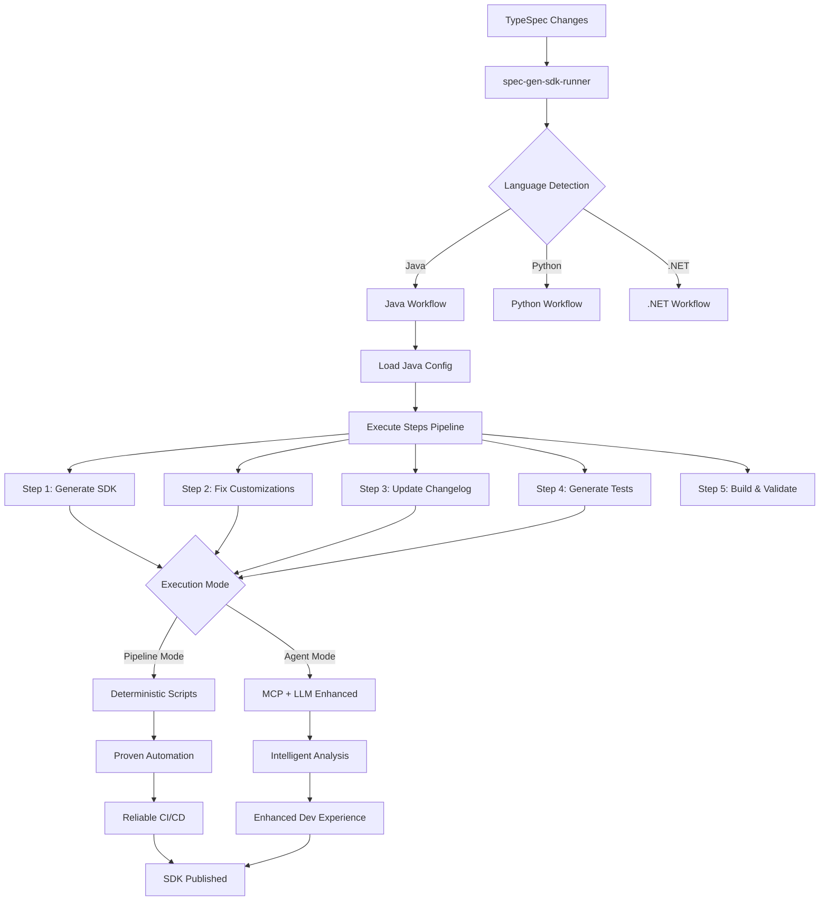

# Spec-gen workflow Modular SDK Generation

## 🔄 Unified Workflow Diagram



## 🏗️ Architecture Achievement Summary

### **1. Modular Contract System**
```
┌─────────────────────────────────────────────────────────┐
│                 Language Config.json                    │
├─────────────────────────────────────────────────────────┤
│ initOptions: { prepareEnvironment, setupDeps }         │
│ generateOptions: { generateScript, fixCustomizations } │  
│ validateOptions: { buildSDK, runTests }                │
│ releaseOptions: { updateChangelog, generateSamples }   │
└─────────────────────────────────────────────────────────┘
```

### **2. Dual Execution Modes**
```
Pipeline Mode (CI/CD)          Agent Mode (Dev Loop)
┌──────────────────┐          ┌─────────────────────┐
│ ✓ Deterministic  │          │ ✓ LLM Enhanced     │
│ ✓ Proven Scripts │    VS    │ ✓ Intelligent      │
│ ✓ No External   │          │ ✓ Context Aware     │
│   Dependencies   │          │ ✓ Interactive       │
└──────────────────┘          └─────────────────────┘
```

### **3. Progressive Enhancement**
```
Existing Proven Scripts     +     Optional MCP Tools     =     Enhanced Workflow
┌───────────────────┐            ┌─────────────────┐           ┌─────────────────┐
│ prepare-environment|
| TypeSpec-Generate │      +     │ fix-customizations│     =   │ Reliable +      │
│ Build-SDK         │            │ generate-tests    │         │ Intelligent     │  
│ Update-Changelog  │            │ generrate-samples |         | SDK Generation  │
└───────────────────┘            └─────────────────┘           └─────────────────┘
      (Untouched)                    (New Layer)                   (Combined)
```

## 🎯 Key Workflow Innovations

### **A. Language-Agnostic Foundation**
- Single `spec-gen-sdk-runner` handles all languages
- Language-specific behavior defined in config files
- Consistent interface across Java, Python, .NET

### **B. Step-Based Execution**
- Each workflow broken into discrete, composable steps
- Steps can run individually or in sequences
- Dependencies automatically resolved

### **C. Backward Compatibility**
- Existing PowerShell/Bash scripts continue working unchanged
- New MCP tools added as optional enhancements
- Zero breaking changes to current workflows

### **D. Intelligent Mode Selection**
```
if (CI_ENVIRONMENT || PIPELINE_MODE) {
    executeMode = 'deterministic'
    enableLLM = false
} else if (AGENT_AVAILABLE || DEV_MODE) {
    executeMode = 'agent'
    enableLLM = true
}
```

## 🚀 Workflow Examples

### **Example 1: Full Generation Pipeline**
```bash
spec-gen-sdk --language java --steps=all --module ./sdk/face/azure-ai-vision-face
```
**Executes**: `prepareEnvironment` → `generateScript` → `fixCustomizations` → `updateChangelog` → `buildSDK`

### **Example 2: Development Iteration**
```bash  
spec-gen-sdk --language java --steps=generateScript,fixCustomizations --agent-mode
```
**Executes**: Core generation + intelligent customization fixes

### **Example 3: Release Preparation**
```bash
spec-gen-sdk --language java --steps=updateChangelog,generateTests,generateSamples
```
**Executes**: Only release-specific enhancement steps

## 🏆 Achievement Summary

| **Challenge** | **Solution Achieved** |
|---------------|----------------------|
| **Reusability** | Existing scripts preserved + enhanced |
| **Modularity** | Step-based composable workflows |
| **Reliability** | Deterministic pipeline mode |
| **Intelligence** | Optional LLM-enhanced agent mode |
| **Integration** | Native MCP tool support |
| **Scalability** | Language-agnostic architecture |

## 🔧 Technical Implementation

### **Config-Driven Execution**
```typescript
const workflow = await loadLanguageConfig('java')
const steps = selectSteps(workflow, requestedSteps)
const mode = detectExecutionMode()

for (const step of steps) {
    if (step.mcpTool && mode === 'agent') {
        await executeMCPTool(step)
    } else {
        await executeScript(step)  
    }
}
```

This workflow achievement enables **both proven reliability and intelligent enhancement** through a unified, modular architecture that scales across all Azure SDK languages.
